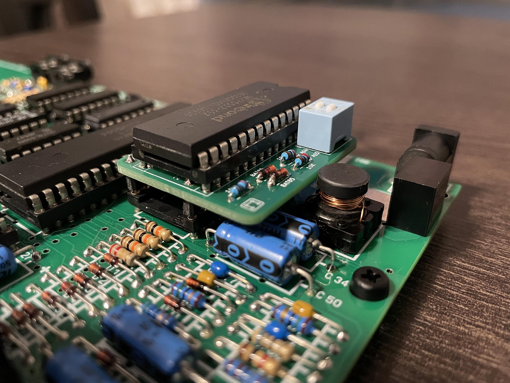
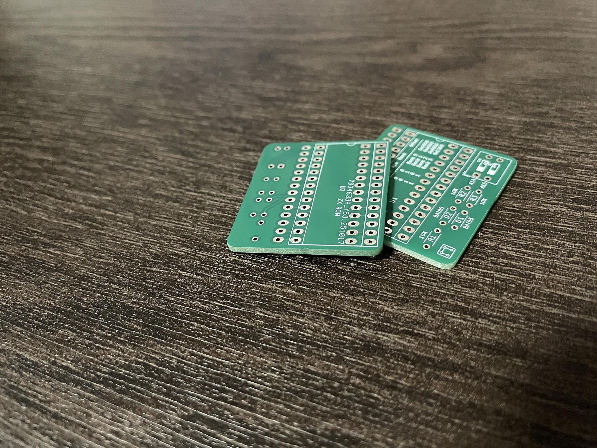
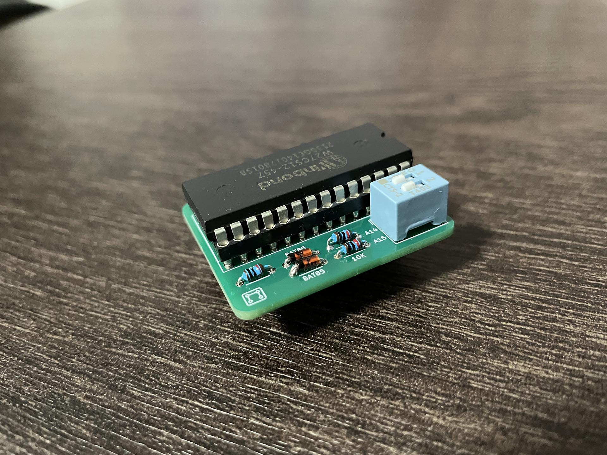

# ZX Spectrum 27C512 EPROM Adapter

This adapter board allows you to replace the original ROM of a ZX Spectrum 48K with a **27C512 (64KB) EPROM**, giving you space for multiple ROM images. Useful for switching between different BASIC versions, custom ROMs, diagnostics tools, etc.
This build is meant for testing and experimenting; the adapter does not fit inside a standard ZX Spectrum 48K case.

## Features

- Compatible with **ZX Spectrum 48K**
- Supports **27C512** EPROMs (64KB)
- Drop-in replacement for the original ZX ROM
- Up to **4 × 16KB ROM banks**
- Works with standard socketed motherboards

## Project Contents

- `ZX_Spectrum_48K_27C512_Adapter/` — full KiCad project files
- `production/` — Gerber files for PCB manufacturing
- `BOM/` — interactive BOM (`ibom.html`)
- Photos of the assembled and installed board (in `/IMG` folder)

## Status

✅ **Working / tested on real hardware**

This is not an original design — it is a compiled version of existing community adapter concepts.

## ROM Bank Info

27C512 = 64KB → allows **4 ROM slots**

| A15 | A14 | Bank      | Offset      |
|-----|-----|-----------|-------------|
| 0   | 0   | Bank 0    | 0x0000      |
| 0   | 1   | Bank 1    | 0x4000      |
| 1   | 0   | Bank 2    | 0x8000      |
| 1   | 1   | Bank 3    | 0xC000      |

Program a 27C512 EPROM with your selected ROMs and plug the adapter into the original ROM socket.
⚠️ ROM files not included.
